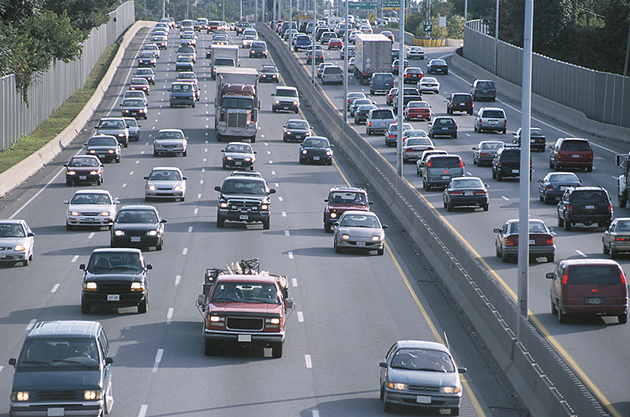
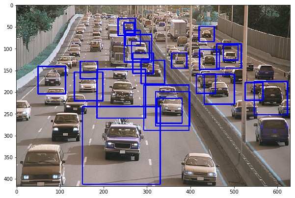

# opencv-car-detection
OpenCV Python program for Vehicle detection

```python
import cv2
from matplotlib import pyplot as plt

car_cascade = cv2.CascadeClassifier('cars.xml')
img = cv2.imread('car3.jpg', 1)
gray = cv2.cvtColor(img, cv2.COLOR_BGR2GRAY)

# Detect cars
cars = car_cascade.detectMultiScale(gray, 1.1, 1)

# Draw border
for (x, y, w, h) in cars:
    cv2.rectangle(img, (x,y), (x+w,y+h), (0,0,255), 2)
    ncars = ncars + 1

# Show image
plt.figure(figsize=(10,20))
plt.imshow(img)
```

## Demo



## Result

